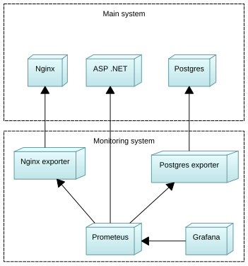

# q-metrics-collection-project
A basic docker compose project with configured automatic metrics collection

To run you need:
* `shell` (bash)
* `git`
* `docker`
* `docker-compose`
* `sudo` (some operations require root access)

Steps to run:
* Edit `config.conf` (config for the script) if you wish.
* Edit `.env` (config for docker-compose images) if you wish.
* Run `init.sh`, grant root access then asked, the script will:
    * create support files (.gitignore);
    * create directory tree for persistent data of docker images;
    * get "default" from images and place in those directories;
    * create docker-compose.yml and docker-compose.override.yml;
    * fill some configs for services;
    * create ASP.NET docker image, using [this](https://github.com/prometheus-net/prometheus-net.git) repo;
    * patch grafana.db with preconfiguration.
* Then grafana service stops to spam about migrations, stop docker-compose via `CTRL+C` or something else. This is needed to create sqlite grafana.db file.
* Script will patch grafana.db, then start docker-compose again. Now to can connect to grafana browser GUI on [localhost](http://localhost:3000) (defaults on port 3000)

Script `clean.sh` will remove everything created by `init.sh` (except cloned repo and created docker images), run it without root permissions to ensure that it will delete correct files.
